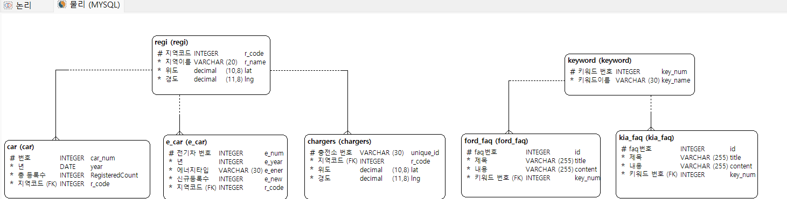

**SK네트웍스 Family AI 캠프 17기 1차 프로젝트**

---

# 1. 팀소개

 ### "안녕하세요! 저희는 2조, COCON입니다. ✨

      ** 저희 팀명 COCON은 'Coding Conqueror'의 약자로, **

      코딩 분야에서 최고의 전문가가 되겠다는 저희의 강력한 의지를 담고 있습니다. 

      어떤 난관에도 굴하지 않고, 끊임없이 배우고 도전하며 코딩의 정상을 향해
  
      나아가겠다는 의지를 팀명에 담아봤습니다.

      앞으로 COCON이 보여드릴 멋진 모습에 많은 기대 부탁드립니다."
      
👥 팀 멤버 (개인 GitHub)

| 이름  | GitHub 계정                                    |
| ----- | ---------------------------------------------- |
| 김주서 | [@kimjuseo71](https://github.com/kimjuseo71)   |
| 성기혁 | [@venus241004](https://github.com/venus241004) |
| 이가은 | [@Leegaeune](https://github.com/Leegaeune)     |
| 임산별 | [@ImMountainStar](https://github.com/ImMountainStar) |
| 조세희 | [@SEHEE-8546](https://github.com/SEHEE-8546)   |

---

# 2. 프로젝트개요

## 💡 프로젝트 명

### 전국 친환경차 등록현황 조회시스템 및  FAQ구현 

## 🌟 프로젝트 소개

 지역별 친환경차(전기차, 하이브리드차)와 전기차차 충천소(인프라) 의 등록현황을 조회할 수 있다. 
과거 5개년치의 등록 데이터를 통해 친환경차와 인프라의 등록 추이를 확인할 수 있다. 
기아자동차와 포드 자동차의 친환경차 관련 FAQ를 확인할 수 있다.

## 🚀 프로젝트 필요성(배경)

 정부의 탄소중립 정책과 기후위기 대응에 따라 친환경차, 특히 전기차와 하이브리드차 시장이 성장하고 있다. 
하지만 현재 제공되는 차량 등록 통계는 대부분 일반 차량 기준이며, 친환경차 중에서도 전기차와 하이브리드차로 세분화된 정보는 제한적이다.
또한 친환경차 데이터와 충전소 데이터가 분산되어 있어, 지역별 친환경차 등록 현황과 인프라 분포를 통합적으로 파악하기 어렵다. 
해당 서비스를 통해 전기차·하이브리드차 등록 현황과 충전 인프라를 통합하여 시각화함으로써, 이해관계자의 전략적 의사결정을 지원한다.

## ✅ 기대효과

1. 지역기반의 전기차,하이브리드차 등록현황과 충전 인프라를 통합 제공하여, 시장세분화 및 지역별 전략 수립에 활용할 수 있다. 

2.  친환경 자동차 시장의 차량 종류별 등록현황 추이를 제공함으로써 급변하는 친환경차 시장의 변화를 파악할 수 있다. 

3.  소비자들이 자주 묻는 질문(FAQ)를 전기차, 하이브리드차, 내연기관차로 분류 및 조회할 수 있어 소비자의 니즈를 파악할 수 있다. 

---

## 📦 데이터 출처 목록

| 데이터 이름                           | 파일 형식 / 수집 방법 | 출처 URL |
|--------------------------------------|------------------------|----------|
| 전국 전기차 충전소 표준데이터         | API / MYSQL              | [바로가기](https://www.data.go.kr/data/15013115/standard.do) |
| 지역, 월별 차량 등록 현황 (통계)      | 직접 다운로드 / CSV    | [바로가기](https://stat.molit.go.kr/portal/cate/statView.do?hRsId=58&hFormId=5498&hSelectId=1244&hPoint=00&hAppr=1&hDivEng=&oFileName=&rFileName=&midpath=&sFormId=5498&sStyleNum=562&settingRadio=xlsx) |
| 현대자동차 홈페이지 FAQ               | Selenium 라이브러리     | [바로가기](https://www.hyundai.co.kr/main/mainRecommend) |
| 포드자동차 홈페이지 FAQ              | Selenium 라이브러리     | [바로가기](https://www.frontierford.com/faq/ford-electric-lineup.htm?srsltid=AfmBOooBqN_a6WwQzWidD_fI7v7RV0FVtLepfbByBUO7VGRhPYe_fvdT) |
| 전기/하이브리드 자동차 종합정보 신규등록정보 (2024)   | API 수집 / MYSQL               | [바로가기](https://www.stgdata.co.kr/data/15059401/openapi.do?recommendDataYn=Y) |

---

# 3. 기술스택

  
  
  
  
  
  
  
  
  

---

# 4. WBS

---

# 5. 요구사항명세서

---

# 6. ERD

---

# 7. 수행결과(시연 페이지)

---

# 8. 한 줄 회고

김주서:
친환경차 등록 현황의 지역별 불균형을 분석하며 세분화된 인사이트의 중요성을 깨달았고, 시각화를 통해 복잡한 데이터 속 숨겨진 정보를 직관적으로 전달할 수 있음을 확인했습니다.

성기혁:
직접 해보는 것이 중요하다는 것을 느꼈습니다. 1차 프로젝트이기 때문에 비교적 쉬운 일이 될 것이라고 예상했지만 막상 부딪혀보니 막히고 어려운 구간이 있었기에 문제를 해결하면서 성장할 수 있게 되었습니다.

이가은:
FAQ 크롤링과 데이터베이스 저장을 구현하면서 웹 자동화 도구인 Selenium의 활용법을 익히고, 수집한 데이터를 구조화하여 데이터베이스에 연동·저장하는 과정을 통해 크롤링부터 DB 구축까지의 전반적인 데이터 처리 흐름을 실무적으로 이해할 수 있었다.

임산별:
API를 통해 다양한 형식의 데이터를 자동 수집하고 이를 데이터베이스에 연동하는 과정을 반복하며, 실시간 데이터 처리 및 저장 기술을 익혔다.

조세희:
api로 여러 곳에서 데이터를 모아오고 의미 있는 통계를 만들기 위하여 mysql에서 데이터들의 의미를 묶고 정규화 하며 실제 사용을 위하여 연동하는 과정까지 직접 진행하며 데이터 분석의 중요성을 깨닫게 되었다.

