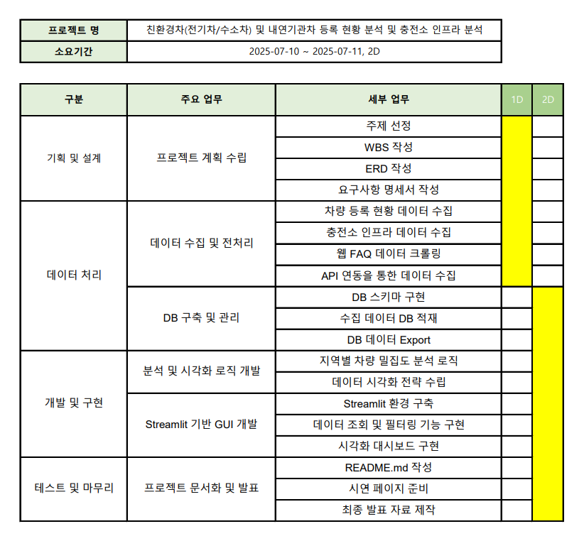

**SK네트웍스 Family AI 캠프 17기 1차 프로젝트**

---

# 1. 팀소개

👥 팀 멤버 (개인 GitHub)

| 이름  | GitHub 계정                                    |
| ----- | ---------------------------------------------- |
| 김주서 | [@kimjuseo71](https://github.com/kimjuseo71)   |
| 성기혁 | [@venus241004](https://github.com/venus241004) |
| 이가은 | [@Leegaeune](https://github.com/Leegaeune)     |
| 임산별 | [@ImMountainStar](https://github.com/ImMountainStar) |
| 조세희 | [@SEHEE-8546](https://github.com/SEHEE-8546)   |

---

# 2. 프로젝트개요

## 💡 프로젝트 명

### EcoScope (에코스코프)
"Eco + Scope" → 친환경차 시장을 넓게 들여다보는 전략 망원경

## 🌟 프로젝트 소개

 본 프로젝트는 전국의 **친환경차(전기차, 하이브리드차) 및 내연기관 차량 등록 및 충전소 인프라 현황과** **기업별 친환경차에 대한 FAQ조회 시스템**을 만들어, 빠르게 변화하는 자동차 시장의 흐름을 파악하고 **기업의 전략적 의사결정에 도움이 되는 데이터 기반 인사이트**를 도출하는 것을 목표로 합니다.

## 🚀 프로젝트 필요성(배경)

 전기차(EV)와 수소차(HEV)는 최근 몇 년 사이 급격한 성장을 이어가고 있으며, 특히 **전기차는 매  달 수천에서 수만 대씩 신규 등록될 정도로 빠르게 보급**되고 있습니다. 이러한 성장세는 지역별로 큰 편차를 보이고 있어, 지역 특성에 따른 수요 분석이 중요해지고 있습니다.

 정부 정책은 일단 수립되면 일정 기간 유지되는 경향이 있어, **정책보다 기업의 전기차 판매 전략 수립에 실질적인 도움이 되는 데이터 기반 분석**이 더 절실합니다. **자동차 제조사 및 관련 기업이 타겟 마케팅, 물류 배치, 서비스망 확장 등 전략적 의사결정**에 활용할 수 있는 실질적인 인사이트를 제공하고자 합니다.

## ✅ 기대효과

1.  **신차 출시에 따른 물류 및 서비스망 전략 최적화**
    * **차종별/지역별 등록 추세**를 분석하여, 어떤 모델이 어디서 잘 팔리는지 명확히 파악합니다.
    * 이를 통해 **재고 관리 및 물류 배치를 최적화**하고, 지역별 수요에 맞는 **A/S망 설계**를 가능하게 합니다.
    * _예: 수도권은 하이브리드, 충청권은 전기 SUV 등록 증가 추세 확인 → 각 지역 거점에 최적화된 차종 배치 및 A/S망 설계 가능_

2.  **경쟁사 대비 시장 점유율 분석 및 대응 전략 도출**
    * 특정 지역의 친환경차 증가가 경쟁사 브랜드 위주로 이루어지는 경우, 해당 지역에 대한 **브랜드 인지도 제고 캠페인**이나 **맞춤형 프로모션 기획**을 지원합니다.
    * 충전 인프라가 부족한 지역에서는 충전소 설치 기업과의 **전략적 제휴 기회**를 모색할 수 있습니다.

3.  **신규 서비스 기획 및 협업 전략 수립**
    * 시장 데이터 분석을 통해 새로운 비즈니스 모델이나 서비스 기획 아이디어를 발굴합니다.
    * 충전 인프라 확충이 필요한 지역에 대한 인사이트는 관련 기업과의 **전략적 제휴 및 협업 기회**를 제공합니다.

---

# 3. 기술스택

  
  
  
  
  
  
  
  
  

---

# 4. WBS

---

# 5. 요구사항명세서

---

# 6. ERD

---

# 7. 수행결과(시연 페이지)

---

# 8. 한 줄 회고

김주서:
친환경차 등록 현황의 지역별 불균형을 분석하며 세분화된 인사이트의 중요성을 깨달았고, 시각화를 통해 복잡한 데이터 속 숨겨진 정보를 직관적으로 전달할 수 있음을 확인했습니다.

성기혁:
방대한 자동차 등록 데이터와 충전소 인프라 데이터를 정제하고 결합하는 과정이 쉽지않았지만, 각 데이터의 특성을 이해하고 처리하는 것이 결국 모델의 정확성을 좌우한다는 것을 체감했습니다. 

이가은:
다양한 친환경차 관련 FAQ를 수집하며 비정형 텍스트 데이터를 구조화하고 탐색하는 방법을 고민하면서, 사용자가 원하는 정보를 빠르게 제공하기 위한 실용적인 데이터 활용 능력을 키울 수 있었습니다.

임산별:
데이터 흐름과 시스템 아키텍처를 설계하며, 수집부터 시각화까지 모든 과정의 유기적 연결성과 효율적인 데이터베이스 설계가 최적의 성능을 좌우한다는 것을 깊이 깨달았습니다.

조세희:
충전소 인프라와 친환경차 등록 현황의 연관성 분석을 통해, 지역의 작은 데이터 변화가 전체 시장에 큰 영향을 미치며, 이러한 미묘한 특성을 반영한 분석 방식 조정이 모델의 예측력을 크게 높인다는 것을 실감했습니다.

